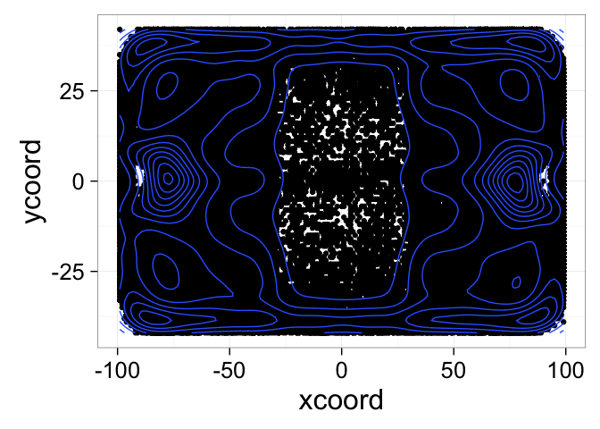
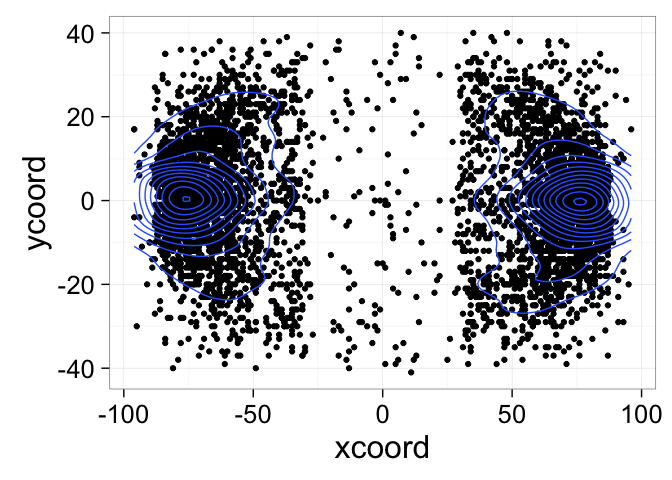
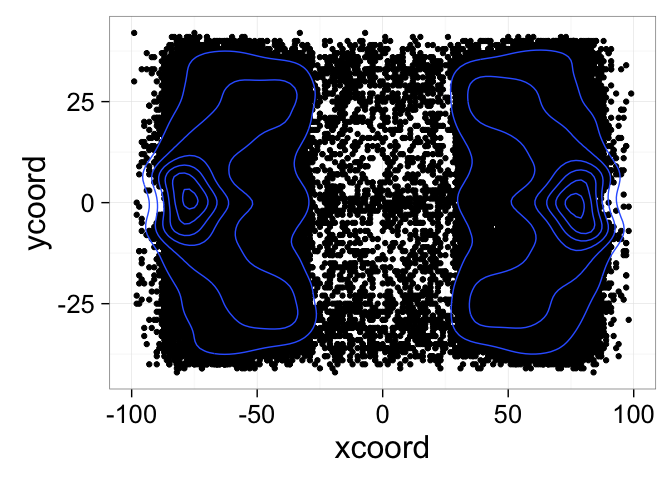
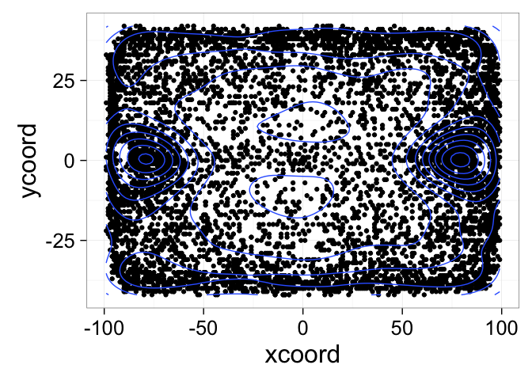
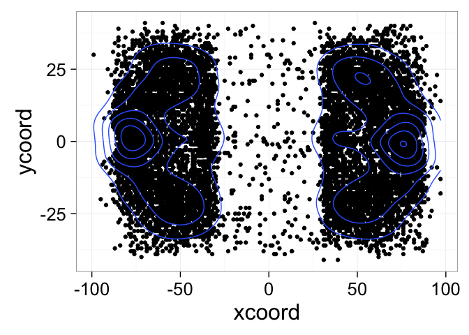
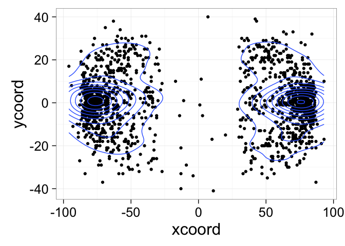
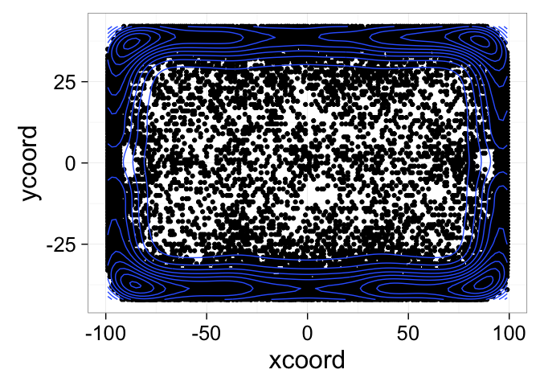
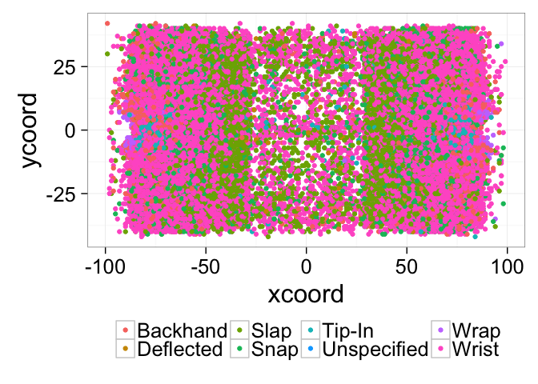

# NHL scritchy scratchy
Going to look at some things using the nhl data ala 

Load up dat core data and setup

```r
library(ggplot2)
theme_set(theme_bw(24))
load("source-data/nhlscrapr-core.RData")
```

Checkin number of unique players by positions, for example:


```r
 theme_set(theme_bw(24))
 c <- ggplot(subset(roster.unique,pos!=''), aes(x=pos))
 c + geom_bar() +xlab("Player Position")
```

<!-- -->


Lets load up 2014 - 2015

```r
load('source-data//nhlscrapr-20142015.RData')
```
Check out event types

```r
table(grand.data$etype)
```

```
## 
##  BLOCK CHANGE  EGPID    EGT  EIEND  EISTR    FAC   GIVE   GOAL    HIT 
##  38545 132296      1      1      4      4  81082  22193   7377  67418 
##   MISS   PEND   PENL   SHOT    SOC   TAKE 
##  30887   4459  10563  72659    173  18004
```

Neat events, plot time

```r
plot(grand.data$xcoord,grand.data$ycoord)
```

<!-- -->
It's a rink!

Look at density of events

```r
ggplot(grand.data, aes(x = xcoord, y = ycoord)) +  geom_point() + geom_density2d()
```

<!-- -->

And just the goals

```r
newDat =grand.data[ which(grand.data$etype=='GOAL'), ]
ggplot(newDat, aes(x = xcoord, y = ycoord)) +  geom_point() + geom_density2d()
```

<!-- -->

And just the shots

```r
newDat =grand.data[ which(grand.data$etype=='SHOT'), ]
ggplot(newDat, aes(x = xcoord, y = ycoord)) +  geom_point() + geom_density2d()
```

<!-- -->

The penalties

```r
newDat =grand.data[ which(grand.data$etype=='PENL'), ]
ggplot(newDat, aes(x = xcoord, y = ycoord)) +  geom_point() + geom_density2d()
```

<!-- -->

And short handed/pp shots

```r
newDat =grand.data[ which(grand.data$etype=='SHOT' & grand.data$away.skaters != grand.data$home.skaters), ]
ggplot(newDat, aes(x = xcoord, y = ycoord)) +  geom_point() + geom_density2d()
```

<!-- -->

And short handed/pp goals

```r
newDat =grand.data[ which(grand.data$etype=='GOAL' & grand.data$away.skaters != grand.data$home.skaters), ]
ggplot(newDat, aes(x = xcoord, y = ycoord)) +  geom_point() + geom_density2d()
```

<!-- -->

And our favorite, hits!

```r
newDat =grand.data[ which(grand.data$etype=='HIT'), ]
ggplot(newDat, aes(x = xcoord, y = ycoord)) +  geom_point() + geom_density2d()
```

<!-- -->

And the types of shots

```r
newDat =grand.data[ which(grand.data$etype=='SHOT'), ]
ggplot(newDat, aes(x = xcoord, y = ycoord, color=as.factor(type))) +  geom_point() +theme(legend.position="bottom",legend.title=element_blank()) 
```

<!-- -->

