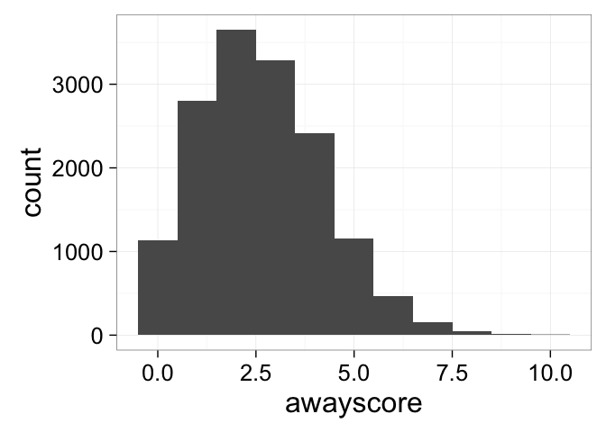
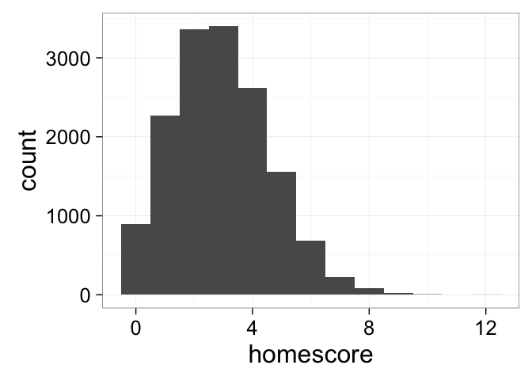
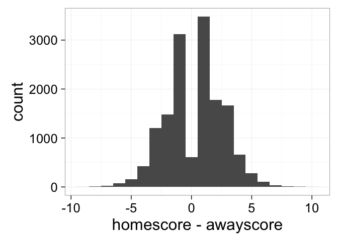

# RandomForestNHL
RotBlauer LLC  
May 2, 2016  

See what random forests do with nhl data ala <a href="https://cran.r-project.org/web/packages/nhlscrapr/index.html">nhlscrapr</a> 

If it's the first time ever...

```r
install.packages("nhlscrapr")
install.packages("ggplot2")
install.packages("randomForest")
library(nhlscrapr)
#compile.all.games() takes a few hours 
compile.all.games()
#or you could git http://goggable.areteh.co:3000/RotBlauer/ZamboniR.git
```


Start with the core data

```r
library(ggplot2)
theme_set(theme_bw(24))
load("../source-data/nhlscrapr-core.RData")
```


Check the game scores

```r
#convert to numeric before plots
games$homescore <- as.numeric(games$homescore)
games$awayscore <- as.numeric(games$awayscore)
ggplot(games, aes(x=awayscore)) + geom_histogram(binwidth=1)
```

<!-- -->

```r
ggplot(games, aes(x=homescore)) + geom_histogram(binwidth=1)
```

<!-- -->

```r
ggplot(games, aes(x=homescore-awayscore)) + geom_histogram(binwidth=1)
```

<!-- -->

We will root for the home team

```r
games$homesW <- games$homescore > games$awayscore
#root for the home team off the bat 
table(games$homesW)
```

```
## 
## FALSE  TRUE 
##  7101  8032
```

